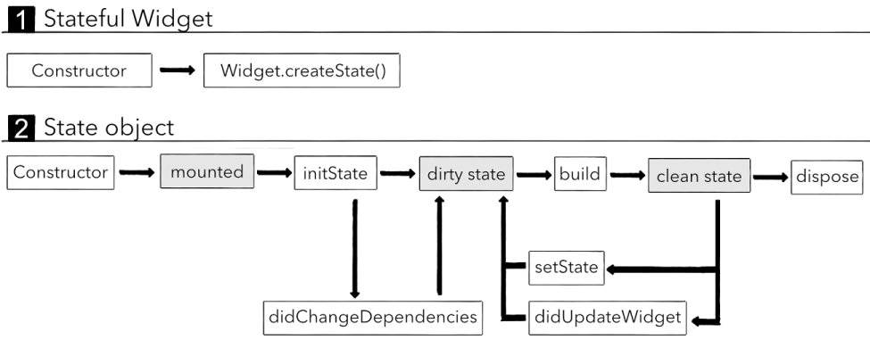

---
categories:
- flutter
tags:
- flutter,flutter技术
keywords: 知识铺,flutter
date: 2020-09-13T14:14:04+08:00
title: flutter 初起步： StatefulWidget生命周期
author: 知识铺
weight: -1
---

# StatefulWidget生命周期

参考: 
- [https://juejin.im/post/5d8897b85188254d8c070365](https://juejin.im/post/5d8897b85188254d8c070365)  

StatefulWidget本身由两个类组成的：`StatefulWidget`和`State`  



首先，执行**StatefulWidget**中相关的方法：

- 1、执行StatefulWidget的构造函数（Constructor）来创建出StatefulWidget；
- 2、执行StatefulWidget的createState方法，来创建一个维护StatefulWidget的State对象；

其次，调用createState创建State对象时，执行State类的相关方法：

- 1、执行State类的构造方法（Constructor）来创建State对象；
- 2、执行initState，我们通常会在这个方法中执行一些数据初始化的操作，或者也可能会发送网络请求；
  - 注意：这个方法是重写父类的方法，必须调用super，因为父类中会进行一些其他操作；
  - 并且如果你阅读源码，你会发现这里有一个注解（annotation）：@mustCallSuper

3、执行didChangeDependencies方法，这个方法在两种情况下会调用  
  - 情况一：调用initState会调用；  
  - 情况二：从其他对象中依赖一些数据发生改变时，比如前面我们提到的InheritedWidget（这个后面会讲到）；  
4、Flutter执行build方法，来看一下我们当前的Widget需要渲染哪些Widget；  
5、当前的Widget不再使用时，会调用dispose进行销毁；  
6、手动调用setState方法，会根据最新的状态（数据）来重新调用build方法，构建对应的Widgets；  
7、执行didUpdateWidget方法是在当父Widget触发重建（rebuild）时，系统会调用didUpdateWidget方法；

示例:  

```dart
import 'package:flutter/material.dart';
import 'package:flutter/widgets.dart';
import 'package:learn_flutter/MyCounterWidget.dart';

main(List<String> args) {
  runApp(MyApp());
}

class MyApp extends StatelessWidget {
  @override
  Widget build(BuildContext context) {
    return MaterialApp(
      home: Scaffold(
        appBar: AppBar(
          title: Text("Hello World"),
        ),
        body: HomeBody(),
      ),
    );
  }
}

class HomeBody extends StatelessWidget {
  @override
  Widget build(BuildContext context) {
    print("1. HomeBody build");
    return MyCounterWidget();
  }
}
```

```dart
import 'package:flutter/material.dart';

class MyCounterWidget extends StatefulWidget {

  MyCounterWidget() {
    print("2. 执行了MyCounterWidget的构造方法");
  }

  @override
  State<StatefulWidget> createState() {
    print("3. 执行了MyCounterWidget的createState方法");
    // 将创建的State返回
    return MyCounterState();
  }
}

class MyCounterState extends State<MyCounterWidget> {
  int counter = 0;

  MyCounterState() {
    print("4. 执行MyCounterState的构造方法");
  }

  @override
  void initState() {
    super.initState();
    print("5. 执行MyCounterState的init方法");
  }

  @override
  void didChangeDependencies() {
    super.didChangeDependencies();
    print("6. 执行MyCounterState的didChangeDependencies方法");
  }

  @override
  Widget build(BuildContext context) {
    print("7. 执行MyCounterState的build方法");
    return Center(
      child: Column(
        mainAxisAlignment: MainAxisAlignment.center,
        children: <Widget>[
          Row(
            mainAxisAlignment: MainAxisAlignment.center,
            children: <Widget>[
              RaisedButton(
                color: Colors.redAccent,
                child: Text("+1", style: TextStyle(fontSize: 18, color: Colors.white)),
                onPressed: () {
                  setState(() {
                    counter++;
                  });
                },
              ),
              RaisedButton(
                color: Colors.orangeAccent,
                child: Text("-1", style: TextStyle(fontSize: 18, color: Colors.white)),
                onPressed: () {
                  setState(() {
                    counter--;
                  });
                },
              ),
            ],
          ),
          Text("当前计数: $counter", style: TextStyle(fontSize: 20))
        ],
      ),
    );
  }

  @override
  void didUpdateWidget(MyCounterWidget oldWidget) {
    super.didUpdateWidget(oldWidget);
    print("8. 执行MyCounterState的didUpdateWidget方法");
  }

  @override
  void dispose() {
    super.dispose();
    print("执行MyCounterState的dispose方法");
  }
}
```

```
flutter: 1. HomeBody build
flutter: 2. 执行了MyCounterWidget的构造方法
flutter: 3. 执行了MyCounterWidget的createState方法
flutter: 4. 执行MyCounterState的构造方法
flutter: 5. 执行MyCounterState的init方法
flutter: 6. 执行MyCounterState的didChangeDependencies方法
flutter: 7. 执行MyCounterState的build方法

// 注意：Flutter会build所有的组件两次
flutter: 1. HomeBody build
flutter: 2. 执行了MyCounterWidget的构造方法
flutter: 8. 执行MyCounterState的didUpdateWidget方法
flutter: 7. 执行MyCounterState的build方法
```

当点击"+1"或"-1"时, 下面方法执行:  

```
7. 执行MyCounterState的build方法
```