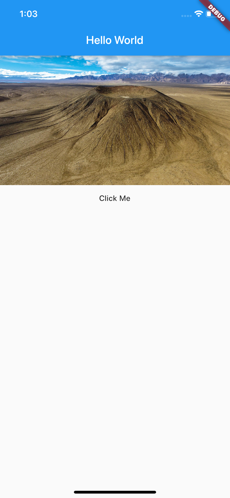
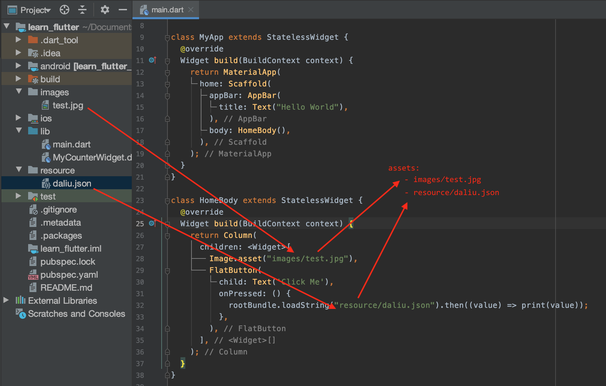

---
categories:
- flutter
tags:
- flutter,flutter技术
keywords: 知识铺,flutter
date: 2020-09-13T14:14:04+08:00
title: flutter 初起步： JSON
author: 知识铺
weight: -1
---

# JSON

学习读取本地JSON资源案例, 以下json片断示例:  

```json
[
{
"nick_name":"daliu 1",
"room_name":"1",
"image_url":"http://a3.att.hudong.com/14/75/01300000164186121366756803686.jpg"
},
{
"nick_name":"daliu 2",
"room_name":"2",
"image_url":"http://e.hiphotos.baidu.com/zhidao/pic/item/d62a6059252dd42a1c362a29033b5bb5c9eab870.jpg"
},
{
"nick_name":"daliu 3",
"room_name":"3",
"image_url":"https://ss0.bdstatic.com/70cFuHSh_Q1YnxGkpoWK1HF6hhy/it/u=188173295,510375359&fm=26&gp=0.jpg"
},
{
"nick_name":"daliu 4",
"room_name":"4",
"image_url":"https://timgsa.baidu.com/timg?image&quality=80&size=b9999_10000&sec=1588183103736&di=9e7a76b8afb6f913f562b645318af0d8&imgtype=0&src=http%3A%2F%2Fpic2.zhimg.com%2Fv2-bfc4f04ecd6b1501a038029b3fb9fdad_b.jpg"
},
{
"nick_name":"daliu 5",
"room_name":"5",
"image_url":"http://www.baidu.com/yy/img/23.png"
},
{
"nick_name":"daliu 6",
"room_name":"6",
"image_url":"http://img.pconline.com.cn/images/upload/upc/tx/wallpaper/1212/26/c4/16907907_1356510053233.jpg"
}
]
```

读取JSON资源，可以使用package:flutter/services.dart包中的rootBundle的`loadString`方法:  

```dart
Future<String> loadString(String key, { bool cache = true }) async {
  ...省略具体代码，可以自行查看源码
}
```

```dart
import 'package:flutter/material.dart';
import 'package:flutter/widgets.dart';
import 'package:flutter/services.dart' show rootBundle;

main(List<String> args) {
  runApp(MyApp());
}

class MyApp extends StatelessWidget {
  @override
  Widget build(BuildContext context) {
    return MaterialApp(
      home: Scaffold(
        appBar: AppBar(
          title: Text("Hello World"),
        ),
        body: HomeBody(),
      ),
    );
  }
}

class HomeBody extends StatelessWidget {
  @override
  Widget build(BuildContext context) {
    return Column(
      children: <Widget>[
        Image.asset("images/test.jpg"),
        FlatButton(
          child: Text('Click Me'),
          onPressed: () {
            rootBundle.loadString("resource/daliu.json").then((value) => print(value));
          },
        ),
      ],
    );
  }
}
```



注: 要加载本地资源, 需要在pubspec.yaml文件中指明: 

```
assets:
  - images/test.jpg
  - resource/daliu.json
```



------------------------------

读取JSON并转换为模型  
```dart
import 'dart:convert';

import 'package:flutter/material.dart';
import 'package:flutter/widgets.dart';
import 'package:flutter/services.dart' show rootBundle;

main(List<String> args) {
  runApp(MyApp());
}

class MyApp extends StatelessWidget {
  @override
  Widget build(BuildContext context) {
    return MaterialApp(
      home: Scaffold(
        appBar: AppBar(
          title: Text("Hello World"),
        ),
        body: HomeBody(),
      ),
    );
  }
}

class HomeBody extends StatelessWidget {
  @override
  Widget build(BuildContext context) {
    return Column(
      children: <Widget>[
        Image.asset("images/test.jpg"),
        FlatButton(
          child: Text('Click Me'),
          onPressed: () {
            testJson();
          },
        ),
      ],
    );
  }

  void testJson() async {
    List<Anchor> anchors = await Anchor().getAnchors();
    for (var o in anchors) {
      o.printInfo();
    }
  }
}

class Anchor {
  String nickName;
  String roomName;
  String imageUrl;

  Anchor({
    this.nickName,
    this.roomName,
    this.imageUrl
  });

  Anchor.withMap(Map<String, dynamic> parsedMap) {
    this.nickName = parsedMap["nick_name"];
    this.roomName = parsedMap["room_name"];
    this.imageUrl = parsedMap["image_url"];
  }
  
  void printInfo() {
    print("nickName: $nickName roomName: $roomName  imageUrl: $imageUrl");
  }

  Future<List<Anchor>> getAnchors() async {
    // 1. 读取json文件
    String jsonString = await rootBundle.loadString("resource/daliu.json");
    // 2.转成List或Map类型
    final jsonResult = json.decode(jsonString);
    // 3. 遍历List，并且转成Anchor对象放到另一个List中
    List<Anchor> anchors = new List();
    for (Map<String, dynamic> map in jsonResult) {
      anchors.add(Anchor.withMap(map));
    }
    return anchors;
  }
}
```

