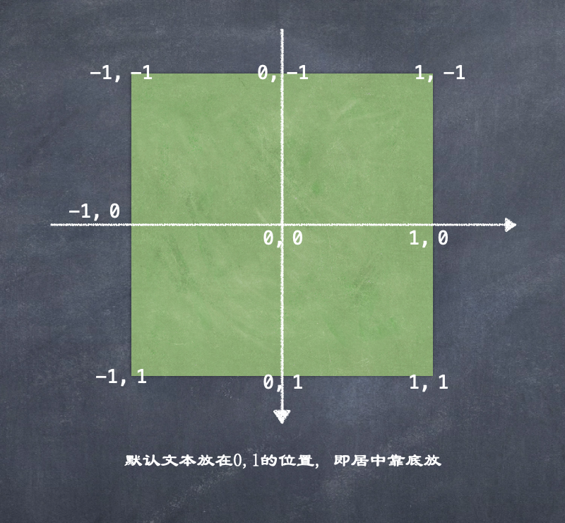

---
categories:
- flutter
tags:
- flutter,flutter技术
keywords: 知识铺,flutter
date: 2020-09-13T14:14:04+08:00
title: flutter 初起步： GridView
author: 知识铺
weight: -1
---

# GridView

参考: 
- [https://juejin.im/post/5d9998c0e51d4577f4608b31](https://juejin.im/post/5d9998c0e51d4577f4608b31)

GridView用于多列的展示,  比如电商中的商品列表, 可做类似于UICollectionView的视图

### GridView构造函数  

可以使用构造函数来创建GridView, 和ListView对比有一个特殊的参数：`gridDelegate`, 它主要用于指定间隔等布局项, 需要传入的类型是SliverGridDelegate, 这是一个抽象类, 所以我们需要传入它的子类, 常用的有两个子类:  
- SliverGridDelegateWithFixedCrossAxisCount: 可以指定交叉轴的item个数(crossAxisCount)
- SliverGridDelegateWithMaxCrossAxisExtent: 可以指定交叉轴的item宽度或高度(maxCrossAxisExtent)

**SliverGridDelegateWithFixedCrossAxisCount**

```dart
SliverGridDelegateWithFixedCrossAxisCount({
  @required double crossAxisCount, // 交叉轴的item个数
  double mainAxisSpacing = 0.0, // 主轴的间距
  double crossAxisSpacing = 0.0, // 交叉轴的间距
  double childAspectRatio = 1.0, // 子Widget的宽高比
  // spacing如果调整, 每个小widget的大小会相应发生变化
})
```

```dart
import 'package:flutter/material.dart';
void main() => runApp(MyApp());

class MyApp extends StatelessWidget {
  // This widget is the root of your application.
  @override
  Widget build(BuildContext context) {
    return MaterialApp(
      title: 'Flutter Demo',
      color: Colors.white,
      home: Scaffold(
        appBar: AppBar(
          title: Text("Title"),
        ),
        body: MyHomePage(),
      )
    );
  }
}

class MyHomePage extends StatelessWidget {
    List<Widget> getGridWidges() {
      return List.generate(100, (index) {
        return Container(
          color: Colors.purple,
          alignment: Alignment(0, 0),
          // 注意这里的Alignment, 是使用单位坐标
          // (0, 0)是中心点, 左上角是 （-1，-1） 右下角是 （1,1）
          child: Text("item$index", style: TextStyle(fontSize: 20, color: Colors.white),),
        );
      });
    }

    @override
  Widget build(BuildContext context) {
    return GridView(
      // gridDelegate用于指定排版
      // 相当于UICollectionView flowLayout
      gridDelegate: SliverGridDelegateWithFixedCrossAxisCount(
        crossAxisCount: 3,
        mainAxisSpacing: 5, // 对于垂直滚动来说, 主轴的间距指上下元素之间的间距
        crossAxisSpacing: 15, // 对于垂直滚动来说, 交叉轴间距指左右元素之间的间距
        childAspectRatio: 1.0
      ),
      children: getGridWidges(),
    );
  }
}
```

在构建Container时有一个alignment属性:  




**SliverGridDelegateWithMaxCrossAxisExtent**

```
SliverGridDelegateWithMaxCrossAxisExtent({
  double maxCrossAxisExtent, // 垂直滚动中表示交叉轴的item宽度
  double mainAxisSpacing = 0.0, // 主轴的间距
  double crossAxisSpacing = 0.0, // 交叉轴的间距
  double childAspectRatio = 1.0, // 子Widget的宽高比
})
```

```dart
import 'package:flutter/material.dart';
void main() => runApp(MyApp());

class MyApp extends StatelessWidget {
  // This widget is the root of your application.
  @override
  Widget build(BuildContext context) {
    return MaterialApp(
      title: 'Flutter Demo',
      color: Colors.white,
      home: Scaffold(
        appBar: AppBar(
          title: Text("Title"),
        ),
        body: MyHomePage(),
      )
    );
  }
}

class MyHomePage extends StatelessWidget {
    List<Widget> getGridWidges() {
      return List.generate(100, (index) {
        return Container(
          color: Colors.purple,
          alignment: Alignment(0, 0),
          // 注意这里的Alignment, 是使用单位坐标
          // (0, 0)是中心点, 左上角是 （-1，-1） 右下角是 （1,1）
          child: Text("item$index", style: TextStyle(fontSize: 20, color: Colors.white),),
        );
      });
    }

  @override
  Widget build(BuildContext context) {
    return GridView(
      gridDelegate: SliverGridDelegateWithMaxCrossAxisExtent(
        maxCrossAxisExtent: 100, // 垂直滚动, 此处指每一项widget的宽, 如果超过屏幕, 则只显示一列
        mainAxisSpacing: 10,
        crossAxisSpacing: 30, // 改变间隔会影响到每行所占的列数
        childAspectRatio: 1.0
      ),
      children: getGridWidges(),
    );
  }
}
```

**前面两种方式也可以不设置delegate**

可以分别使用：`GridView.count构造函数`和`GridView.extent`构造函数实现相同的效果

--------------------------------

### GridView.builder

和ListView一样，使用构造函数会一次性创建所有的子Widget，会带来性能问题，所以我们可以使用`GridView.build`来交给GridView自己管理需要创建的子Widget 

```dart
import 'dart:convert';

import 'package:flutter/material.dart';
import 'package:flutter/services.dart';
import 'package:hello/Anchor.dart';
void main() => runApp(MyApp());

class MyApp extends StatelessWidget {
  // This widget is the root of your application.
  @override
  Widget build(BuildContext context) {
    return MaterialApp(
        title: 'Flutter Demo',
        color: Colors.white,
        home: Scaffold(
          appBar: AppBar(
            title: Text("Title"),
          ),
          body: MyHomePage(),
        )
    );
  }
}

class MyHomePage extends StatefulWidget {
  @override
  State<StatefulWidget> createState() {
    return MyHomePageState();
  }
}

class MyHomePageState extends State<MyHomePage> {
  List<Anchor> anchors = [];

  @override
  void initState() {
    getAnchors().then((anchors) {
      setState(() {
        this.anchors = anchors;
      });
    });
    super.initState();
  }

  Future<List<Anchor>> getAnchors() async {
    print("here");
    String jsonString = await rootBundle.loadString("resources/json/json.txt");
    final jsonResult = json.decode(jsonString);
    List<Anchor> anchors = new List();
    for (Map<String, dynamic> map in jsonResult) {
      anchors.add(Anchor.withMap(map));
    }
    print("------------> ${anchors.length}");
    return anchors;
  }

  @override
  Widget build(BuildContext context) {
    return Padding(
      padding: const EdgeInsets.all(8.0),
      child: GridView.builder(
        shrinkWrap: true, // Whether the extent of the scroll view in the scrollDirection should be determined by the contents being viewed.
        physics: ClampingScrollPhysics(),
        gridDelegate: SliverGridDelegateWithFixedCrossAxisCount(
            crossAxisCount: 2,
            mainAxisSpacing: 10,
            crossAxisSpacing: 10,
            childAspectRatio: 1
        ),
        itemCount: anchors.length,
        itemBuilder: ((BuildContext context, int index) {
          return Container(
            child: Column(
              crossAxisAlignment: CrossAxisAlignment.start,
              children: <Widget>[
                Image.network(anchors[index].imageUrl),
                SizedBox(height: 5,),
                Text(anchors[index].nickName, style: TextStyle(fontSize: 16),),
                Text(anchors[index].roomName, maxLines: 1, overflow: TextOverflow.ellipsis,)
              ],
            ),
          );
        }),
      ),
    );
  }
}
```


