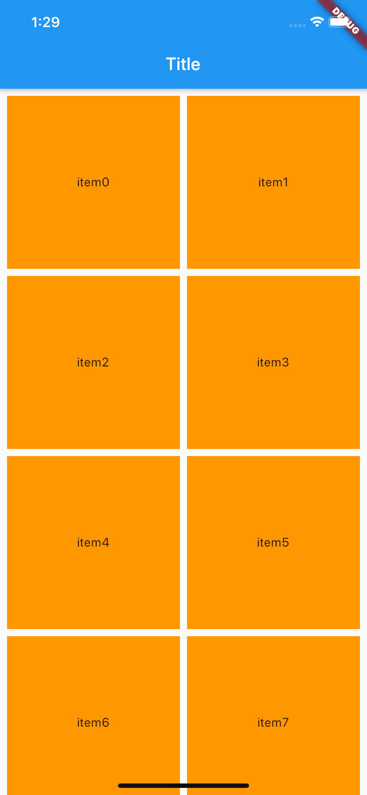
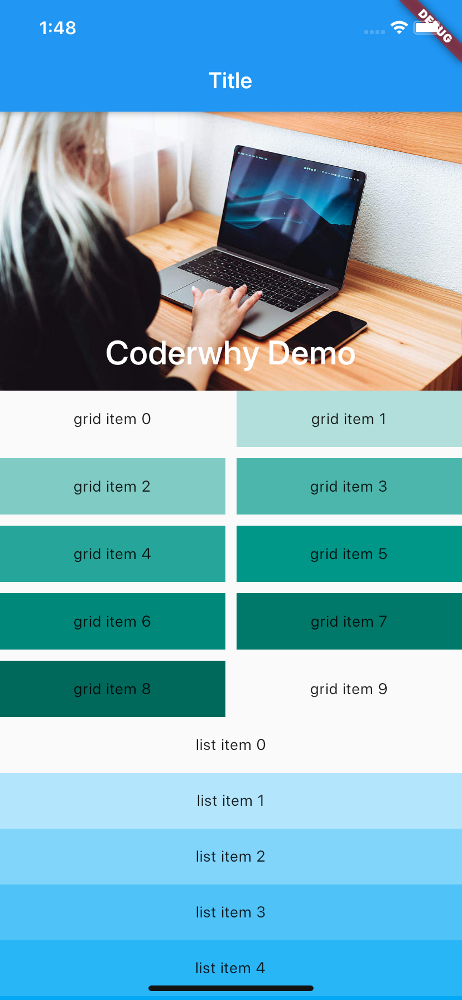
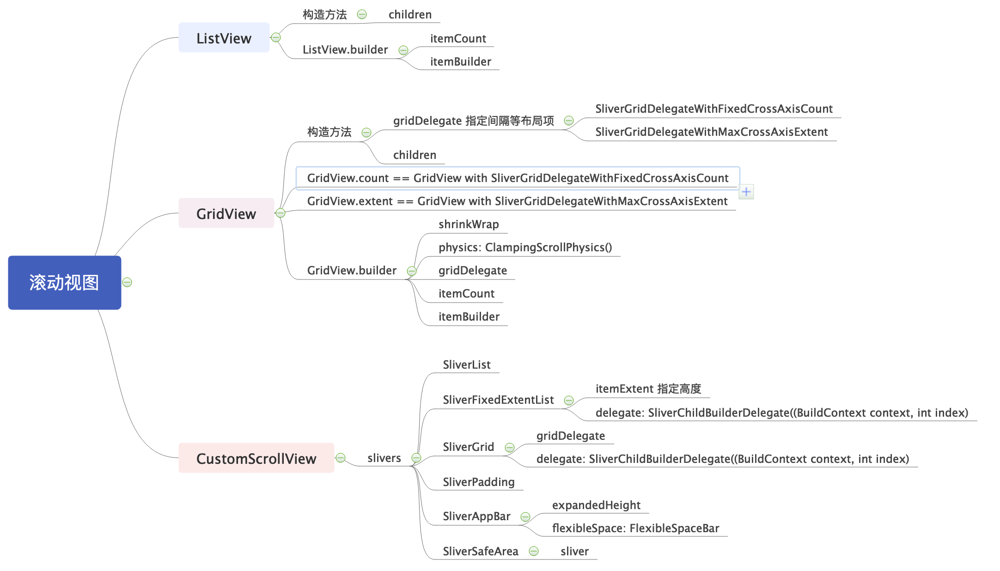

---
categories:
- flutter
tags:
- flutter,flutter技术
keywords: 知识铺,flutter
date: 2020-09-13T14:14:04+08:00
title: flutter 初起步： Slivers
author: 知识铺
weight: -1
---

# Slivers

考虑一个这样的布局：一个滑动的视图中包括一个标题视图（HeaderView），一个列表视图（ListView），一个网格视图（GridView）, 这种复杂场景可以使用CustomScrollView结合Sliver实现. 在CustomScrollView中，每一个独立的，可滚动的Widget被称之为Sliver  

CustomScrollView有一个slivers属性，里面让我们放对应的一些Sliver：  
- SliverList：类似于我们之前使用过的ListView；
- SliverFixedExtentList：类似于SliverList，只是可以设置滚动的高度；
- SliverGrid：类似于我们之前使用过的GridView；
- SliverPadding：设置Sliver的内边距，因为可能要单独给Sliver设置内边距；
- SliverAppBar：添加一个AppBar，通常用来作为CustomScrollView的HeaderView；
- SliverSafeArea：设置内容显示在安全区域（比如不让齐刘海挡住我们的内容）

SliverGrid+SliverPadding+SliverSafeArea的组合示例:  



```dart
import 'dart:convert';

import 'package:flutter/material.dart';
import 'package:flutter/services.dart';
import 'package:hello/Anchor.dart';
void main() => runApp(MyApp());

class MyApp extends StatelessWidget {
  // This widget is the root of your application.
  @override
  Widget build(BuildContext context) {
    return MaterialApp(
        title: 'Flutter Demo',
        color: Colors.white,
        home: Scaffold(
          appBar: AppBar(
            title: Text("Title"),
          ),
          body: MyHomePage(),
        )
    );
  }
}

class MyHomePage extends StatelessWidget {
  @override
  Widget build(BuildContext context) {
    return CustomScrollView(
      slivers: <Widget>[
        SliverSafeArea(
          sliver: SliverPadding(
            padding: const EdgeInsets.all(8),
            sliver: SliverGrid(
              gridDelegate: SliverGridDelegateWithFixedCrossAxisCount(
                crossAxisCount: 2,
                crossAxisSpacing: 8,
                mainAxisSpacing: 8,
              ),
              delegate: SliverChildBuilderDelegate((BuildContext context, int index) {
                return Container(
                  alignment: Alignment(0, 0),
                  color: Colors.orange,
                  child: Text("item$index"),
                );
              },
              childCount: 20
              ),
            ),
          ),
        ),
      ],
    );
  }
}
```

-------------------------------------

再看一个示例:  



```dart
import 'package:flutter/material.dart';
void main() => runApp(MyApp());

class MyApp extends StatelessWidget {
  // This widget is the root of your application.
  @override
  Widget build(BuildContext context) {
    return MaterialApp(
        title: 'Flutter Demo',
        color: Colors.white,
        home: Scaffold(
          appBar: AppBar(
            title: Text("Title"),
          ),
          body: MyHomePage(),
        )
    );
  }
}

class MyHomePage extends StatelessWidget {
  @override
  Widget build(BuildContext context) {
    return showCustomScrollView();
  }

  Widget showCustomScrollView() {
    return new CustomScrollView(
      slivers: <Widget>[
        const SliverAppBar(
          expandedHeight: 250,
          flexibleSpace: FlexibleSpaceBar(
            title: Text('Coderwhy Demo'),
            background: Image(
              image: NetworkImage("https://tva1.sinaimg.cn/large/006y8mN6gy1g72j6nk1d4j30u00k0n0j.jpg"),
              fit: BoxFit.cover,
            ),
          ),
        ),
        new SliverGrid(
          gridDelegate: new SliverGridDelegateWithMaxCrossAxisExtent(
            maxCrossAxisExtent: 200.0,
            mainAxisSpacing: 10.0,
            crossAxisSpacing: 10.0,
            childAspectRatio: 4.0
          ),
          delegate: new SliverChildBuilderDelegate((BuildContext context, int index) {
            return new Container(
              alignment: Alignment.center,
              color: Colors.teal[100 * (index % 9)],
              child: Text('grid item $index'),
            );
          }, childCount: 10),
        ),
        SliverFixedExtentList(
          itemExtent: 50, // 高
          delegate: SliverChildBuilderDelegate((BuildContext context, int index) {
            return Container(
              alignment: Alignment.center,
              color: Colors.lightBlue[100 * (index % 9)],
              child: new Text('list item $index'),
            );
          }, childCount: 20),
        ),
      ],
    );
  }
}
```

导图: 



