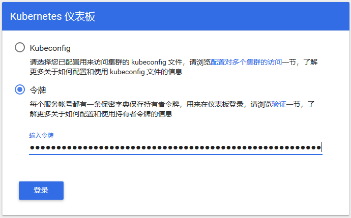
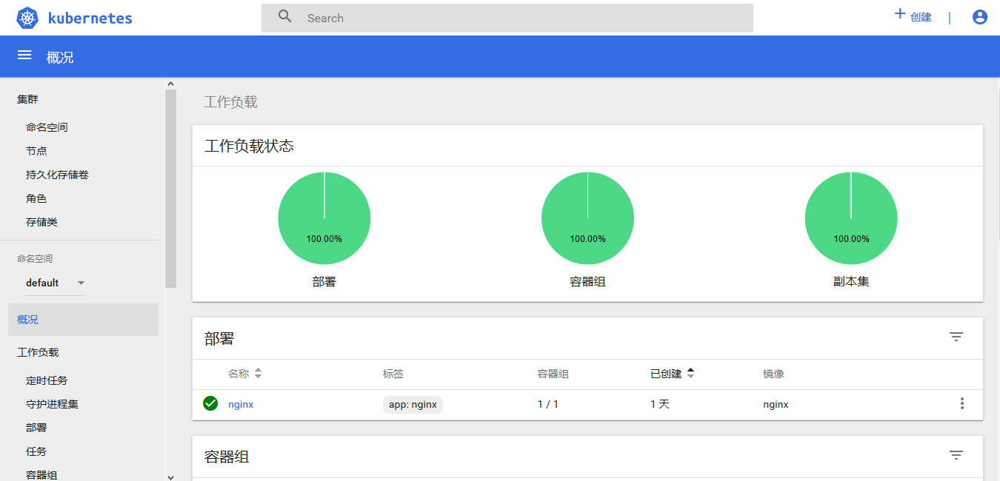

# 一、环境准备

## 1、设置主机名hostname，管理节点设置主机名为master

```
 # hostnamectl set-hostname master
```

 

设置其他节点主机名称时，可将master替换为正确的主机名node1,node2,node3即可。

## 2、编辑/etc/hosts文件，添加域名分析

```
cat <<EOF >>/etc/hosts  
192.168.56.10 master    
192.168.56.11 node1     
192.168.56.12 node2     
EOF 

```

## 3.关闭防火墙、selinux和swap。

依次执行以下操作 

```

# systemctl stop firewalld         
# systemctl disable firewalld     
# setenforce 0    
# sed -i "s/^SELINUX=enforcing/SELINUX=disabled/g"/etc/selinux/config   
# swapoff -a   
# sed    -i  's /.* swap.*/#&/'/etc/fstab

```

## 4.配置内核参数，将桥接的IPv4流量传递到iptables的链

```
cat >/etc/sysctl.d/k8s.conf <<EOF  
net.bridge.bridge-nf-call-ip6tables =1  
net.bridge.bridge-nf-call-iptables =1  
EOF
```


## 5、配置国内yum源

```
# yum install -y wget  
# mkdir /etc/yum.repos.d/bak && mv /etc/yum.repos.d/*.repo /etc/yum.repos.d/bak  
# wget -O /etc/yum.repos.d/CentOS-Base.repo http://mirrors.cloud.tencent.com/repo/centos7_base.repo  
# wget -O /etc/yum.repos.d/epel.repo http://mirrors.cloud.tencent.com/repo/epel-7.repo  
# yum clean all && yum makecache  
```

　　配置国内Kubernetes源


```
cat <<EOF >/etc/yum.repos.d/kubernetes.repo  
[kubernetes]  
name=Kubernetes  
baseurl=https://mirrors.aliyun.com/kubernetes/yum/repos/kubernetes-el7-x86_64/  
enabled=1  
gpgcheck=1  
repo_gpgcheck=1  
gpgkey=https://mirrors.aliyun.com/kubernetes/yum/doc/yum-key.gpg https://mirrors.aliyun.com/kubernetes/yum/doc/rpm-package-key.gpg
EOF  
```


```
 配置 docker 源
# wget https://mirrors.aliyun.com/docker-ce/linux/centos/docker-ce.repo -O /etc/yum.repos.d/docker-ce.repo  

 
```


```
二、软件安装
```

注：在所有节点上进行如下操作

## 1、安装docker

```
# yum install -y docker-ce  
# systemctl enable docker && systemctl start docker  
# docker --version 

```


docker服务为容器运行提供计算资源，是所有容器运行的基本平台。

## 2、安装kubeadm、kubelet、kubectl 

```
# yum install -y kubelet kubeadm kubectl  
# systemctl enable kubelet 

 Kubelet负责与其他节点集群通信，并进行本节点Pod和容器生命周期的管理。Kubeadm是Kubernetes的自动化部署工具，降低了部署难度，提高效率。Kubectl是Kubernetes集群管理工具，此处注意Kubectl的版本信息，后面会用到！
```

#  三、部署master节点

注：在master节点上进行如下操作

## 1、在master进行Kubernetes集群初始化。

　　根据前一步安装信息，安装相应版本的kubernetes（此处为 1.15.1） 

```
kubeadm init --kubernetes-version=1.15.1 \  
--apiserver-advertise-address=192.168.56.10 \  
--image-repository registry.aliyuncs.com/google_containers \  
--service-cidr=192.1.0.0/16 \  
--pod-network-cidr=192.244.0.0/16  

定义POD的网段为: 192.244.0.0/16， api server地址就是master本机IP地址。
```

   这一步很关键，由于kubeadm 默认从官网k8s.grc.io下载所需镜像，国内无法访问，因此需要通过–image-repository指定阿里云镜像仓库地址，很多人初次部署都卡在此环节无法进行后续配置。（此处需要下载镜像，会耗费时间）

集群初始化成功后返回如下信息：

 

记录生成的最后部分内容，此内容需要在其它节点加入Kubernetes集群时执行。

```
kubeadm join 192.168.56.10:6443 --token k1er5o.grhehxo4yw34rd4a \
    --discovery-token-ca-cert-hash sha256:ccf93f9e2736e6ca696449758991873a16402c2355482c813239d7c7054d61ff
```

## 2.配置kubectl工具

```
# mkdir -p /root/.kube  
# cp /etc/kubernetes/admin.conf /root/.kube/config  
# kubectl get nodes  
# kubectl get cs 
```

## 3.部署flannel网络 

```
# kubectl apply -f https://raw.githubusercontent.com/coreos/flannel/a70459be0084506e4ec919aa1c114638878db11b/Documentation/kube-flannel.yml
```


四、部署node节点

 注：在所有node节点上进行如下操作

执行如下命令，使所有node节点加入Kubernetes集群

```
kubeadm join 192.168.56.10:6443 --token k1er5o.grhehxo4yw34rd4a \
    --discovery-token-ca-cert-hash sha256:ccf93f9e2736e6ca696449758991873a16402c2355482c813239d7c7054d61ff

此命令为集群初始化时（kubeadm init）返回结果中的内容。
```

#  五、集群状态监测

 注：在master节点上进行如下操作

## 1.在master节点输入命令检查集群状态，返回如下结果则集群状态正常。

```
# kubectl get nodes 
```

 

 重点查看STATUS内容为Ready时，则说明集群状态正常。

 

##  2.创建Pod以验证集群是否正常。

```
# kubectl create deployment nginx --image=nginx  
# kubectl expose deployment nginx --port=80--type=NodePort  
# kubectl get pod,svc
 
```

# 六、部署Dashboard 

注：在master节点上进行如下操作

## 1.创建Dashboard的yaml文件

```
# wget https://raw.githubusercontent.com/kubernetes/dashboard/v1.10.1/src/deploy/recommended/kubernetes-dashboard.yaml  
# sed -i 's/k8s.gcr.io/loveone/g' kubernetes-dashboard.yaml
# sed -i '/targetPort:/a\ \ \ \ \ \ nodePort: 30001\n\ \ type: NodePort' kubernetes-dashboard.yaml
```

  2.部署Dashboard 

```
# kubectl create -f kubernetes-dashboard.yaml  
```

##   

##   3.创建完成后，检查相关服务运行状态

```
# kubectl get deployment kubernetes-dashboard -n kube-system  
# kubectl get pods -n kube-system -o wide  
# kubectl get services -n kube-system  
# netstat -ntlp|grep 30001 
 
```

### 4.在Firefox浏览器输入Dashboard访问地址：https://192.168.9.159:30001

## 5.查看访问Dashboard的认证令牌

```
# kubectl create serviceaccount  dashboard-admin-n kube-system   
# kubectl create clusterrolebinding  dashboard-admin--clusterrole=cluster-admin --serviceaccount=kube-system:dashboard-admin  
# kubectl describe secrets -n kube-system $(kubectl -n kube-system get secret | awk '/dashboard-admin/{print $1}')  
```

  

##  6.使用输出的token登录Dashboard。

 

 认证通过后，登录Dashboard首页如图



 

 至此kubernetes集群搭建完成。 


### 问题1：关闭Swap

 ```
#关闭Swap，机器重启后不生效
swapoff -a


# 修改/etc/fstab永久关闭Swap
cp -p /etc/fstab /etc/fstab.bak$(date '+%Y%m%d%H%M%S')
# Redhat
sed -i "s/\/dev\/mapper\/rhel-swap/\#\/dev\/mapper\/rhel-swap/g" /etc/fstab
# CentOS
sed -i "s/\/dev\/mapper\/centos-swap/\#\/dev\/mapper\/centos-swap/g" /etc/fstab
# 修改后重新挂载全部挂载点
mount -a

# 查看Swap
free -m
cat /proc/swaps
 ```


### 问题2：1.18版本需要提前准备master01的证书

**master01**

```
scp -rp /etc/kubernetes/pki/ca.* master02:/etc/kubernetes/pki
scp -rp /etc/kubernetes/pki/sa.* master02:/etc/kubernetes/pki
scp -rp /etc/kubernetes/pki/front-proxy-ca.* master02:/etc/kubernetes/pki
scp -rp /etc/kubernetes/pki/etcd/ca.* master02:/etc/kubernetes/pki/etcd
scp -rp /etc/kubernetes/admin.conf master02:/etc/kubernetes
```

重新运行命令加入节点，查看集群节点

```shell
[root@master02 ~]# kubectl get nodes
NAME       STATUS     ROLES    AGE   VERSION
master01   NotReady   master   24m   v1.18.3
master02   NotReady   master   37s   v1.18.3
```


### 问题3 清理老版本docker


```
 列出docker安装过的相关包：
 sudo yum list installed | grep docker
 
删除相关安装包
sudo yum -y remove docker-ce.x86_64
sudo yum -y remove docker-ce-selinux.noarch

删除相关的镜像与容器
sudo rm -rf /var/lib/docker

sudo yum remove docker  docker-common docker-selinux docker-engine
```