## 决策引擎产品介绍

决策引擎承载的是风控业务的专家知识，基于变量和模型的输出，对用户进行分层、用户风险判断、以及用户风险定价的操作。其核心为判断流程的编制。 决策引擎产品提供可视化操作，支持判断逻辑的多种组合，流程链路配置，支持0开发部署上线，使得策略迭代速度能够得到最大的优化。

## 决策引擎功能模块：

### 策略画布

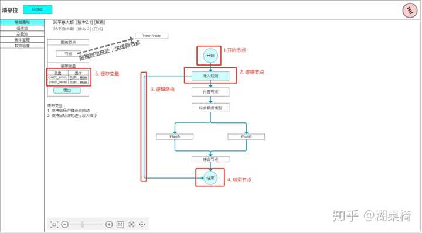![](imgs/v2-3ac12013d19f5a619d859d84afc03238_720w.jpg

 策略画布是一个策略的主干，承担着执行链路配置的功能。画布中主要的组成部分如下：

1. 开始节点：开始节点为策略执行的第一步，开始节点上定义了策略基本信息，策略code、策略名称、策略版本描述。

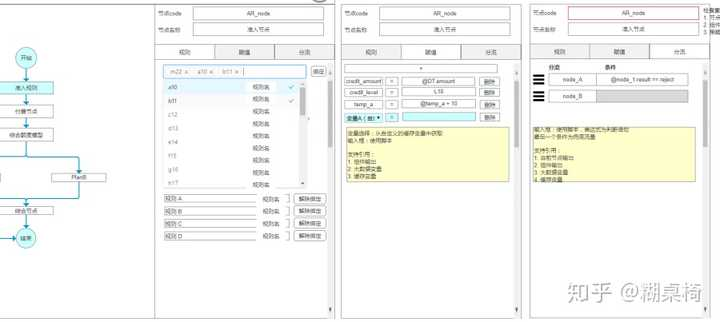![img](imgs/v2-cb6cc8206e68dae55f8e4b07d490687c_720w.jpg

1. 缓存变量：缓存变量做为策略的一个临时容器，可以将某些值扔进来存储，以便后续使用。缓存变量的值，最后将作为策略结果进行输出。
2. 节点：策略执行判断承载器，逻辑节点主要作用为
3. 规则执行：逻辑节点绑定了策略中定义好的规则（可以参见组件-规则定义），逻辑节点运行会对规则进行执行，根据规则的结果（rule.result）进行综合输出，作为节点的输出（node.result）。综合逻辑为，取规则结果中最为严重的结果（reject>reference>pass）。
4. 缓存变量赋值：缓存变量赋值主要是将某个执行结果的值赋予缓存变量，作为用户执行路径的记录。例如，走到a节点，用户就是好人；走到b节点，用户就是坏人，依此。
5. 分流：分流作为判断节点下一步走到哪里，是逻辑分流的实现。

![img](imgs/v2-cb6cc8206e68dae55f8e4b07d490687c_720w.jpg

1. 分流：

增加分流：可以在图中两个节点A，B之间进行连线，代表A的下一个执行节点为B。一个节点的分流可以有多个（开始节点除外），例如A节点可以和 B、C、D相互连接，形成以下三条路由： A -> B： A -> C： A -> D：  判断如何走到分支，由分流上的判断条件来判断。如下 分流1 A -> B： if judge_1 == true 分流2 A -> C： if judge_2 == ture 分流3 A -> D：  分流判断的条件从上到下顺序执行，满足一条条件则走该分流 最后的分流：示例中的 分流为兜底路由，如果上述两条分流的条件都不满足，则走该条分流。

1. 结束节点：

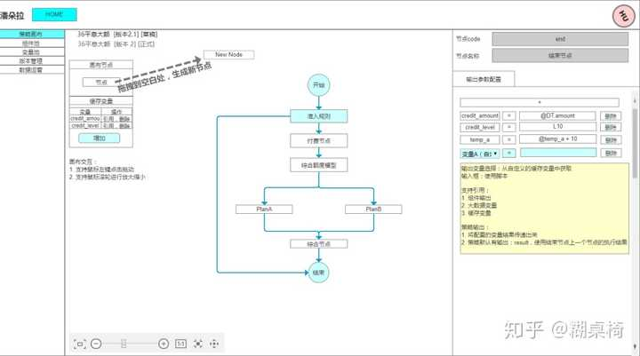![img](imgs/v2-632bce00462898962a53cb1368221060_720w.jpg

 结束节点为最后结束的节点，所有分流都必须走到结束节点。结束节点没有后续连接的节点。结束节点中包含的内容为：输出变量配置，可以绑定的为 策略变量，进行策略变量的输出操作。  最后策略的输出为：

1. result：策略判断结果，策略的结果为结束节点上游分支的判断结果
2. 输出参数：结束节点中，输出参数中配置的策略变量，以及对应的值

### 策略组件

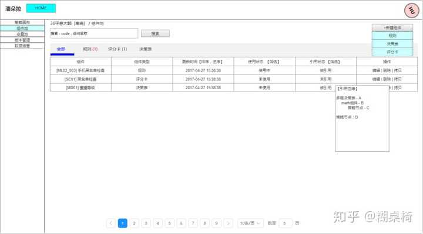![img](imgs/v2-fab26a61ecaf023062789890d0478a55_720w.jpg

 策略组件有 规则、评分卡、决策表 三个类型构成，具体详情可见组件介绍。  组件血缘：记录了策略中组件相互之间关联的关系，从上最开始的策略到最下面的变量。依据血缘的引用，定义了组件的 引用和使用这两种状态：

1. 是否引用：组件的输出，是否被其他组件使用（往上走）
2. 是否使用：是否使用：向上走是否能够走到某一节点

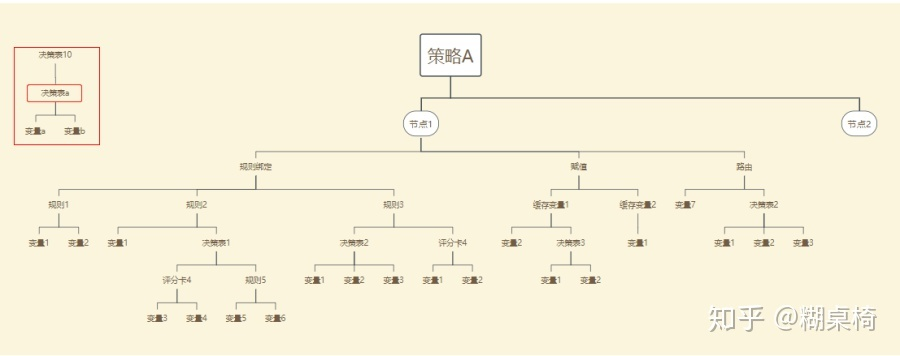![img](imgs/v2-5d3532a1540542b2b34cf9a872ded799_720w.jpg

 血缘的引用关系将会在组件的修改过程中被检查：

1. 组件删除：需要检查该组件是否引用，防止删除之后程序不能运行
2. 组件的输出删除：例如决策表的输出，输出如果被其他地方使用，该输出则不能删除

### 策略组件-规则

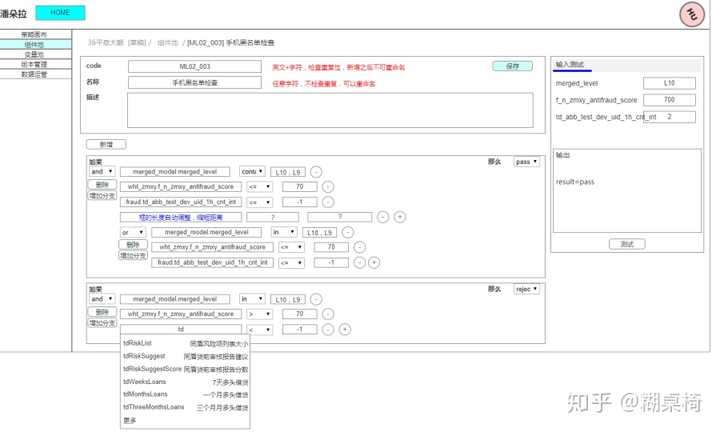![img](imgs/v2-74857caaaf3a0f98ba80329f9cbc2c94_720w.jpg

**规则配置：** 规则执行的是if…then…语句的判断，可以进行的操作有：配置 if的多层嵌套，条件可以是 并（and） 以及 或（or）。  

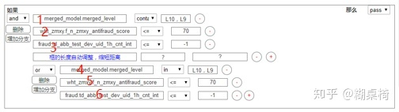![img](imgs/v2-405ff8374f06eaff6a71ace36571ee66_720w.jpg

 上图中的执行语表示为：if { 1 and 2 and 3 and { 4 or 5 or 6}}  判断语句下拉框会根据选择的变量类型，来选择对应的匹配符，如果是数值型的变量，则提供 数值型判断（=, !=, >, <, >=, <=），如果是文本型的变量则提供（in，not in，contain，not contain，is null，is notnull，==，!=，~=）。  **规则执行判断：** 规则执行中一行条件为一个执行单位，执行单位根据组合的规则是否命中决定最后结果。一条规则中会有多个执行单位，规则将对执行单位的结果进行汇总，汇总的逻辑为 取最为严重的结果，如果执行单位中有 一个为reject，则规则结果为 reject。如果执行单位中 没有reject，执行单位中 有一个为 reference，则规则结果为 reference。如果执行单位结果全部为 pass，则最后结果为 pass。

### 策略组件-决策表

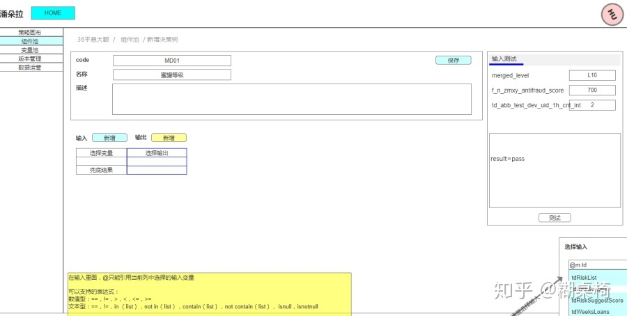![img](imgs/v2-d71ef33b3f4daea4080fcfe6a03216f5_720w.jpg

**决策表介绍，**决策表提供的是变量交叉组合之后给予特定结果。 **决策表配置：**决策表配置是以表格为基础的，每一列都有一个变量，分为输入和输出。每一行，是一个判断条件组合，表示 如果（变量1 条件， 变量2 条件，变量3 条件，…）都满足则，执行 输出（输出变量 =1， 输出变量 =2）。  **决策表的变量支持：**

- 输入：增加（可以使用 缓存变量，大数据变量，组件输出），删除
- 输出：增加（自定义 输出变量的 变量名，变量类型），删除
- 行：增加，删除
- 条件设置：条件使用脚本表达式进行配置
- 输出配置：输出配置，可以使用 常量，引用（@， 支持 缓存变量，大数据变量，组件输出），以及计算公式（加减乘除）

**决策表执行逻辑：** 

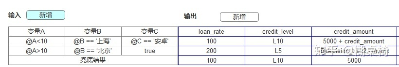![img](imgs/v2-754ccd9ba2d742c6655e6fbc444ef827_720w.jpg

 决策表执行，将配置表的信息从上往下执行，第一个命中的行则将相应的结果值输出。以上述配置为例，如果 A为20，B为北京，则该决策表会命中其中第二行条件。结果为：loan_rate=200，credit_level=L5，credit_amount为 decision_tree2的输出amount的值。    

### 策略组件-评分卡

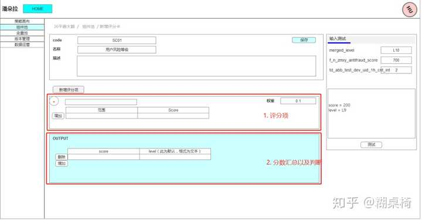![img](imgs/v2-9f76aa0f1bba14092d25e6ac19766b15_720w.jpg

 评分卡分为两个部分：评分项（根据单条件给对应的分值），评分汇总判断（根据各个评分项的结果，进行加总评分，根据总评分来划分不同档位）。  评分项配置：

1. 选择变量：（可以使用 缓存变量，大数据变量，组件输出）
2. 变量条件值配置：一个评分项目里面的条件配置，只能有使用一个变量来进行条件判断
3. 分值：配置变量条件满足对应的分值

 评分项执行：

1. 每个评分项都会执行
2. 评分项内部条件从上到下顺序执行，只要有一个条件满足，则给对应的分值。该评分项下面其他的条件不再执行
3. 一个评分项如果都没有命中，则会给一个默认分 0。业务方会对评分规则进行尽量穷举

 评分汇总判断：

1. 汇总会对评分卡内所有分值
2. 根据分值score进行分区段判断，对应分段给对应的level不同赋值

### 策略版本操作

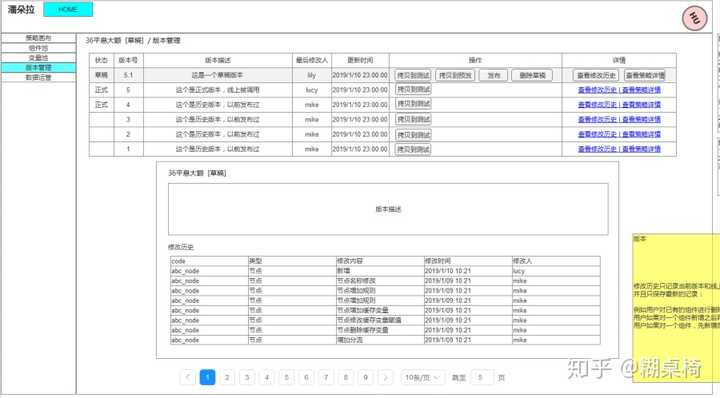![img](imgs/v2-ec9205e3d74ae94216773aa481de3806_720w.jpg

 策略版本管理主要功能为：

1. 版本控制：多环境之间的同步（测试，预发，线上）
2. 多版本查看：草稿版本，正式版本（历史所有版本）
3. 版本修改历史和快照：查看版本修改的明细记录，以及当时的策略快照

**版本控制操作说明：针对正式环境** 1. 拷贝到测试：将当前的策略拷贝到测试环境中去，如果测试环境已经有同名策略，则进行覆盖，作为新建的策略，将版本作为草稿版本 2. 保存到预发： 将当前的策略拷贝到预发环境中去，如果预发环境已经有同名策略，则进行覆盖，作为新建的策略，将版本作为草稿版本 3. 发布：发布到正式环境，策略生效 4. 删除草稿：将当前草稿修改的内容清空，还原成上一个版本的状态  测试环境：拷贝到测试和拷贝到预发 功能失效，无法拷贝 预发环境：拷贝到测试和拷贝到预发 功能失效，无法拷贝  **多版本查看：版本变化说明** 版本有草稿和正式两种，草稿版本发布之后会变为正式版本。草稿版本编号以 XX.1为标识，正式版本都为 整数版本号。  **版本修改历史：**每次变更都记录，不记录具体变更内容  画布变更： 【类型：节点】 1. 新增 2. 修改 • 节点（基础属性）：修改（节点名称） • 节点（规则）：修改（增加规则，删除规则） • 节点（赋值）：修改（增加缓存变量，删除缓存变量，赋值表达式变更） • 节点（分流）：修改（新增加路由，删除路由，路由优先级变更，路由表达式变更） 3. 删除 4. 开始节点：修改（策略名称修改，版本描述修改） 5. 结束节点： • 节点（赋值）：修改（增加缓存变量，删除缓存变量，赋值表达式变更）  【缓存变量】 1. 缓存变量：新增 2. 缓存变量：删除  组件变更： 【组件】 1. 组件：新增 2. 组件：修改 3. 组件：删除  版本变更： 1. 发布 2. 新建  记录示例如下：  

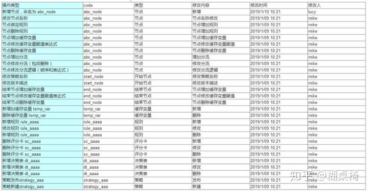![img](imgs/v2-683585b4a963b420df5cbe6481b0a9a6_720w.jpg

### 策略运营：debug

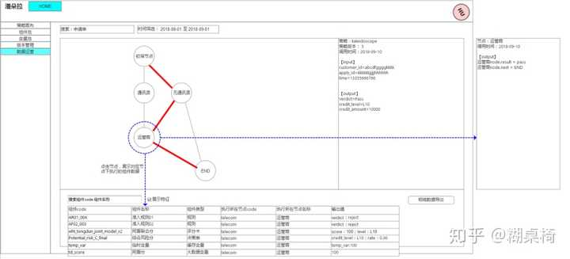![img](imgs/v2-9c6cfe4a5d68a33aef10297bdee28fbf_720w.jpg

**策略debug：**主要是为了回溯特定订单在策略内执行的路径，主要场景有，对某些定价出现问题的客户，回溯当时策略执行的完整路径。  **主要展示内容：**

1. 节点执行路径，图中由画布节点图和对应的路径展示
2. 策略整体结果，在右边侧边栏展示出 对应的策略执行结果，包括（策略名称，版本，调用时间， 策略输入，策略输出）
3. 具体组件执行结果：下方展示，展示组件（规则，决策表，评分卡）、缓存变量、大数据变量的执行记录。以表格形式展示，支持搜索组件code，组件名称。
4. 图上交互：点击节点，会对数据进行筛选，右侧的节点结果以及下方的具体执行结果

### 决策引擎功能一览

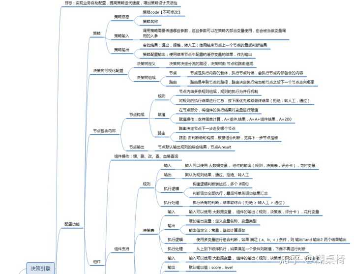![img](imgs/v2-0de66dcd887bdfcd9741eebc2ee6b8ed_720w.jpg

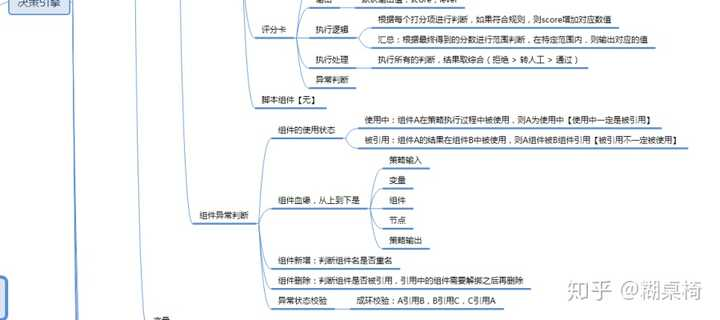![img](imgs/v2-7a6b9741867cbd847f9616568ac1c960_720w.jpg

